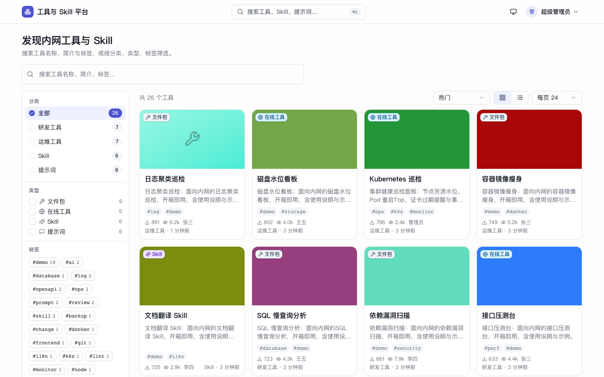
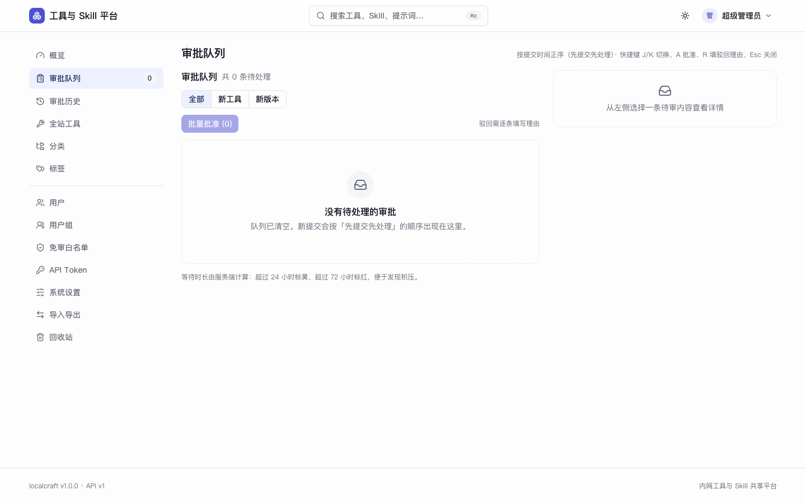
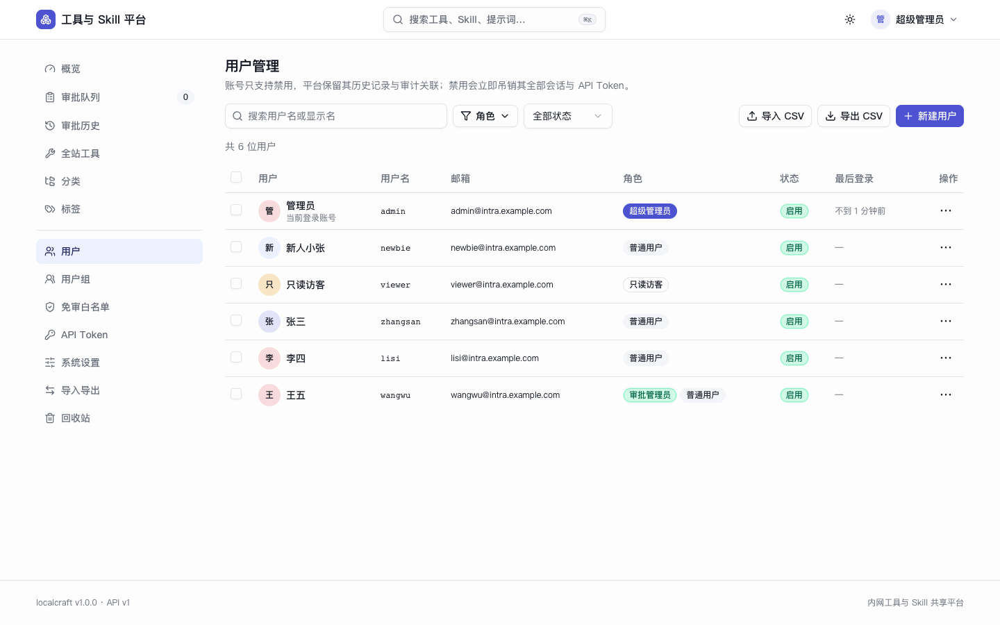
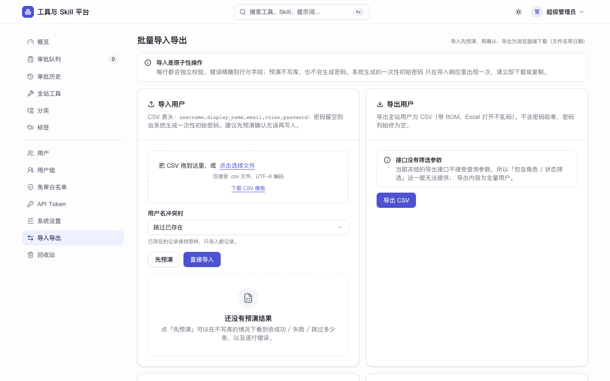
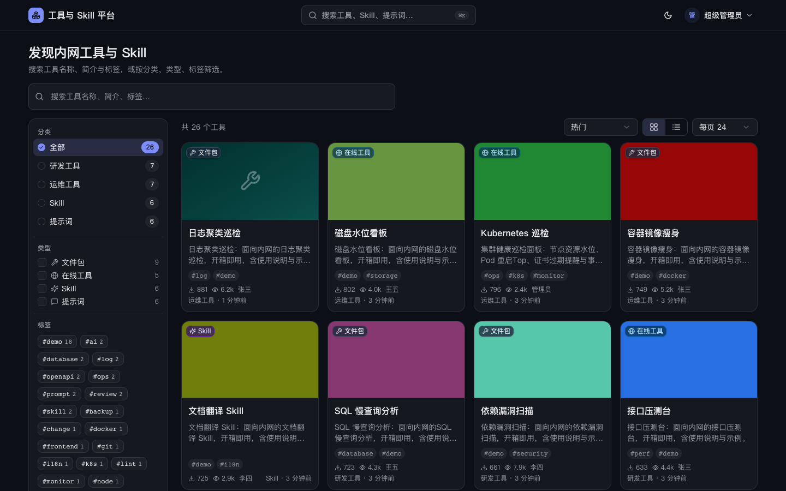

# localcraft

**面向内网的自托管工具 / Skill 共享平台** —— 把团队里散落各处的脚本、工具包、Agent Skill、Prompt 模板收进一个可检索、可审批、可版本管理的门户。

[](https://github.com/jacob-bytes/localcraft/actions/workflows/ci.yml)
[](LICENSE)
[](https://www.python.org/)
[](https://react.dev/)

---

## 这是什么

一百来人的研发团队里，工具通常是怎么流转的？某个同事写了个好用的批量改配置脚本，扔进群文件；另一个人做了个 SQL 优化 Prompt，发在聊天记录里；再有人把几个可执行文件打包丢到共享盘。三个月后没人记得哪个是最新版、谁维护、能不能对外用。

localcraft 把这件事收敛成一个内网站点：

- **门户大屏** —— 卡片墙 + 分类侧栏 + 全文检索，按分类和标签归档整齐
- **个人主页** —— 授权用户上传自己的工具，填简介详情、传封面图、发新版本
- **审批闭环** —— 管理员审批上架；可切「一键全放行」，也可只放行白名单用户
- **管理 API** —— 签发长效 Token，脚本可以一键批量导入导出、管理用户与权限

它从设计之初就是给**离线内网**用的：不依赖任何外部服务，不需要容器，一次装好就长期跑着。

## 核心特性

| 能力 | 说明 |
| --- | --- |
| **四种工具形态** | 文件包（zip / tar.gz / whl / exe）、Agent Skill 包（zip 内含 `SKILL.md`，服务端解压出文件树并渲染预览）、在线网页工具（内网 URL 直跳）、Prompt 模板（纯文本在线预览） |
| **三级可见性** | `public` 全员 / `restricted` 指定用户或用户组 / `private` 仅自己；超管可开关式查看 `private` 内容 |
| **四角色 RBAC** | 超级管理员 / 审批管理员 / 普通用户 / 只读访客；管理员建号，**无自助注册**，首次登录强制改密 |
| **版本管理** | SemVer 字符串手填（不强制格式）；同一工具可反复发新版本，**历史版本最多保留 10 份**，超出按最旧淘汰 |
| **审批流** | 全局开关「需审批 / 全放行」+ 用户白名单免审；驳回必填理由，用户可改后重提；完整审批历史可查；支持下架与重新上架 |
| **检索** | SQLite FTS5 全文索引（切 PostgreSQL 后走 `tsvector`），支持分类、标签、形态、可见性多维筛选 |
| **统计** | 下载量与浏览量走**内存聚合 + 定时批量落库**，不做逐请求自增写入 |
| **管理 API** | 长效 API Token（`st_` 前缀，SHA256 落库，可吊销、可限 Scope）+ OpenAPI 自动文档 + 批量导入导出 |

## 界面

<table>
<tr>
<td width="50%"><br><sub><b>工具门户</b> —— 卡片墙 + 分类侧栏 + 全文检索，26 个演示工具</sub></td>
<td width="50%"><br><sub><b>工具详情</b> —— 版本时间线、Skill 包文件树、下载票据</sub></td>
</tr>
<tr>
<td width="50%"><br><sub><b>个人主页</b> —— 上传私有工具 / Skill，查看审批状态与历史版本</sub></td>
<td width="50%"><br><sub><b>审批台</b> —— 全局开关「需审批 / 全放行」+ 用户白名单免审</sub></td>
</tr>
<tr>
<td width="50%"><br><sub><b>用户与权限</b> —— 四角色 RBAC、用户组、账号锁定与强制改密</sub></td>
<td width="50%"><br><sub><b>批量导入导出</b> —— 管理 API 的可视化对应，也可纯脚本调用</sub></td>
</tr>
<tr>
<td width="50%"><br><sub><b>暗色模式</b> —— 亮/暗/跟随系统三态；文本对比度复测浅色与深色各 0/812 不达标</sub></td>
<td width="50%"><br><sub><b>登录</b> —— 无自助注册，管理员建号，首次登录强制改密</sub></td>
</tr>
</table>

> 截图由 [`web/scripts/capture-screenshots.mjs`](web/scripts/capture-screenshots.mjs) 在真实后端 + 真实种子上生成，
> 可随时重跑：先 `PORT=8099 bash preview.sh`，再 `cd web && PORT=8099 node scripts/capture-screenshots.mjs`。
> 脚本会对每张图做自检（正文长度、卡片数、暗色主题是否生效），避免提交空白页或错误页。

## 技术栈

**后端** Python 3.11 · FastAPI · SQLAlchemy 2.0（async）· Alembic · Pydantic v2 · uvicorn
**前端** React 18 · Vite 5 · TypeScript（strict）· Tailwind CSS v4 · shadcn/ui · TanStack Query v5 · react-router-dom 6
**数据库** SQLite（WAL）为默认；通过 SQLAlchemy + Alembic 抽象，**切 PostgreSQL 只改连接串**
**部署** systemd 原生部署 · nginx 反向代理 · **不使用 Docker / Podman / 任何容器方案**
**架构** x86_64 与 aarch64 双架构，各交付一套离线 wheelhouse

## 架构

```
                        ┌──────────────────────────────┐
   浏览器 ──────────────▶│  nginx                       │
                        │  TLS 终止 / 静态资源 / 限流    │
                        └───────────────┬──────────────┘
                                        │  proxy_pass
                        ┌───────────────▼──────────────┐
                        │  uvicorn（单 worker）         │
                        │  ├─ /api/v1/*   REST 接口     │
                        │  ├─ /docs       OpenAPI       │
                        │  └─ /*          前端 SPA 产物  │
                        └───────────────┬──────────────┘
                                        │
              ┌─────────────────────────┼─────────────────────────┐
              ▼                         ▼                         ▼
    ┌──────────────────┐   ┌──────────────────────┐   ┌──────────────────┐
    │ SQLite (WAL)     │   │ /var/lib/localcraft  │   │ 内存计数聚合       │
    │ 20 张表 + FTS5   │   │ 上传文件 / 封面图     │   │ 定时批量落库       │
    │ 可换 PostgreSQL  │   │ 版本归档 / 备份       │   │ tool_stats_daily │
    └──────────────────┘   └──────────────────────┘   └──────────────────┘
```

**为什么是单 worker**：SQLite 在 WAL 下仍是单写者。生产刻意只跑一个 uvicorn worker，靠 asyncio 扛 I/O 并发 —— 加 worker 不会提升写吞吐，只会加剧锁竞争。真要横向扩，先换 PostgreSQL 再谈。

## 快速开始

### 本机一键预览（推荐先试这个）

需要 **Python 3.11+** 和 **Node.js 18+**：

```bash
git clone https://github.com/jacob-bytes/localcraft.git
cd localcraft

# 建 venv、装依赖、建库、播种演示数据、构建前端、起服务 —— 全部自动
bash preview.sh
```

跑完打开 <http://127.0.0.1:8000>。首次会自动播种 **26 个演示工具 / 6 个账号**（含 8 个边界样本：无封面、超长名称、空文件树等）。

```bash
bash preview.sh --reset     # 丢弃预览数据重新来
PORT=8090 bash preview.sh   # 换端口
```

预览数据落在 `.preview/`（已 gitignore），不碰 `backend/var/`。预览是**生产拓扑**：后端直接托管前端构建产物，单一 URL，没有独立前端进程也没有代理。

演示账号（全部为虚构数据）：

| 角色 | 账号 | 密码 | 用途 |
| --- | --- | --- | --- |
| 超级管理员 | `admin` | `Admin@12345` | 全部页面 |
| 审批员 | `wangwu` | `Author@12345` | user + approver，验证审批台与角色边界 |
| 普通用户 | `zhangsan` / `lisi` | `Author@12345` | 上传与个人主页 |
| 只读访客 | `viewer` | `Viewer@12345` | 能看详情但下载被拒 |
| 需改密 | `newbie` | `Newbie@12345` | 登录后被强制跳转改密页 |

### 分别起前后端（开发模式）

```bash
# 终端 1 —— 后端
cd backend
python3.11 -m venv .venv && .venv/bin/pip install -r requirements.lock
.venv/bin/python -m alembic upgrade head       # 建库 + 迁移
.venv/bin/python -m app.cli seed-demo          # 播种演示数据
.venv/bin/python -m uvicorn app.main:app --reload --port 8000

# 终端 2 —— 前端（Vite 代理 /api 到 8000）
cd web
npm install
npm run dev                                    # http://127.0.0.1:5173
```

开发模式下前端默认启用 MSW mock（`VITE_ENABLE_MOCKS=true`），不连后端也能点通全部页面。

## 部署到 openEuler

目标环境：**openEuler 24.03 LTS SP1 ~ SP4**，x86_64 或 aarch64，systemd 原生部署。

openEuler 官方源自带 `python3.11` rpm，**目标机不需要编译 Python**。整个安装过程可以完全离线。

```bash
# 在联网构建机上产出发布包（含目标架构的完整离线 wheelhouse）
bash scripts/build-wheelhouse.sh --arch x86_64     # 或 aarch64
bash scripts/make-release.sh

# 在目标机上安装
tar xzf localcraft-1.0.0-<arch>.tar.gz && cd localcraft-1.0.0-<arch>
sudo LOCALCRAFT_WHEELHOUSE="$PWD/wheelhouse" bash install.sh
```

`install.sh` 会依次完成：建 `localcraft` 系统用户 → 解包到 `/opt/localcraft` → 用离线 wheelhouse 建 venv → 建 `/var/lib/localcraft` 与 `/etc/localcraft` → 装 systemd unit / slice / tmpfiles / logrotate → 跑 Alembic 迁移 → 启动并做健康检查。

演练时可以跳过需要 root 的步骤：

```bash
LOCALCRAFT_SKIP_SYSTEMD=1 bash install.sh    # 跳过 useradd/chown/systemctl，用 nohup 起
```

配套脚本：`backup.sh` / `restore.sh` / `verify-backup.sh`（一致性备份与恢复）、`upgrade.sh` / `rollback.sh`（升级与回滚）、`uninstall.sh`、`security-check.sh`、`disk-alert.sh`、`metrics-snapshot.sh`。

## 配置

所有配置走环境变量，生产放 `/etc/localcraft/localcraft.env`（`0640 root:localcraft`）。完整示例见 [`deploy/localcraft.env.example`](deploy/localcraft.env.example)。

| 变量 | 默认 | 说明 |
| --- | --- | --- |
| `LOCALCRAFT_HOST` / `LOCALCRAFT_PORT` | `127.0.0.1` / `8000` | 监听地址；生产由 nginx 反代，不直接对外 |
| `LOCALCRAFT_PUBLIC_BASE_URL` | `http://127.0.0.1:8000` | 生成签名 URL 与下载链接的基址 |
| `DATABASE_URL` | `sqlite+aiosqlite:///…/localcraft.db` | 换 PostgreSQL 时改这里 |
| `DATA_DIR` | `./var` | 上传文件、封面、归档、备份的根目录 |
| `SECRET_KEY` | —— | **必改**。`openssl rand -hex 32` 生成 |
| `ACCESS_TOKEN_MINUTES` / `REFRESH_TOKEN_DAYS` | `30` / `7` | 访问令牌与刷新令牌有效期 |
| `COOKIE_SECURE` | `true` | 生产必须 `true`（HTTPS）；本机预览置 `false` |
| `API_DOCS_ENABLED` | `false` | 生产默认关闭 `/docs` |
| `LOGIN_MAX_FAILURES` / `LOCKOUT_MINUTES` | `5` / `15` | 登录失败锁定策略 |
| `DB_BUSY_TIMEOUT` | `5000` | SQLite 忙等待毫秒数 |
| `DB_POOL_SIZE` / `DB_MAX_OVERFLOW` | `5` / `5` | 连接池；仅 PostgreSQL 生效 |

> 环境变量名不做统一前缀：`LOCALCRAFT_*` 只用于应用自身的 5 个字段（host/port/debug/version/public_base_url），其余沿用直觉命名（`DATABASE_URL`、`SECRET_KEY`…）。

## 项目结构

```
localcraft/
├── backend/                 FastAPI 应用
│   ├── app/
│   │   ├── api/v1/          路由层（75 路径 / 93 操作）
│   │   ├── core/            配置、安全、依赖注入、日志
│   │   ├── models/          19 张表的 ORM 模型（+ FTS5 虚拟表）
│   │   ├── repositories/    数据访问
│   │   ├── services/        业务逻辑
│   │   └── cli.py           命令行（init-db / seed / create-user / …）
│   ├── migrations/          Alembic 迁移（0001~0004）
│   ├── tests/               449 个测试
│   └── openapi.json         OpenAPI 快照 —— 接口形状的**权威**，测试守卫其时效性
├── web/                     React SPA
│   └── src/{pages,components,api,lib}
├── deploy/                  systemd unit / slice / tmpfiles / nginx / logrotate
├── scripts/                 安装、备份、升级、演练、发布等 24 个运维脚本
├── docs/                    需求、数据模型、API、前端、部署、手册共 12 份
├── contracts/               接口契约与验收脚本
├── prompts/                 每个开发里程碑的任务书
└── preview.sh               本机一键预览
```

## 文档

`docs/` 里的 12 份文档是这个项目从需求澄清到交付的完整轨迹，全部保留：

| 文档 | 内容 |
| --- | --- |
| [01-需求规格说明书](docs/01-需求规格说明书.md) | 角色权限、编号功能需求、业务规则与状态机、非功能需求、验收标准 |
| [02-数据模型设计](docs/02-数据模型设计.md) | ER 关系、20 张表的字段级设计、索引、约束、迁移策略 |
| [03-API接口清单](docs/03-API接口清单.md) | REST 接口全集、请求/响应示例、错误码、鉴权与 Scope 矩阵 |
| [04-前端页面与交互清单](docs/04-前端页面与交互清单.md) | 路由表、每页组件拆解、shadcn/ui 选型、空态与异常态 |
| [05-部署与运维方案](docs/05-部署与运维方案.md) | 离线双架构打包、systemd、nginx、备份恢复、升级回滚、故障排查 |
| [06-用户手册](docs/06-用户手册.md) / [07-管理员手册](docs/07-管理员手册.md) / [08-运维手册](docs/08-运维手册.md) | 面向三类使用者的操作手册 |
| [09-勘误与已知限制](docs/09-勘误与已知限制.md) | 文档与实现不一致处的勘误表（**优先级高于它所修正的文档**） |
| [10-交付前置检查清单](docs/10-交付前置检查清单.md) | 交付检查项与真实状态，含未完成项 |
| [11-优化点分析](docs/11-优化点分析.md) | 性能剖析与优化结论 |
| [12-前端UI-UX审查](docs/12-前端UI-UX审查.md) | 可访问性与视觉审查，含审查者自身误报的复盘 |

[`contracts/CONTRACT.md`](contracts/CONTRACT.md) 是并行开发时的**唯一事实来源**，记录了接口冻结、边界裁定与交付台账。

## 测试与质量

```bash
# 后端：lint + 449 个测试（约 90% 覆盖率）
cd backend && .venv/bin/python -m ruff check . && .venv/bin/python -m pytest

# 前端：typecheck + lint + 组件约束 + 构建产物检查
cd web && npm run verify

# 端到端：MSW mock（默认）或真实后端
cd web && npm run e2e              # mock
cd web && npm run e2e:real         # 需要 preview.sh 已在跑

# 交付前自动化检查（36 项）
bash contracts/acceptance/pre-delivery-checks.sh
```

几条刻意为之的工程约束：

- **`backend/openapi.json` 被纳入版本控制**，并有测试守卫它必须与实现同步 —— 它是接口形状的权威，前端类型从这个文件生成。
- **前端有 `check:api-types` / `check:primitives` / `check:dist` / `check:lazy-retry` 四道结构检查**，防止手写类型漂移、绕过设计原语、mock 代码混进生产产物、以及懒加载 chunk 失效导致白屏。
- **`ruff` 的 `target-version = "py311"`** 是硬防线：本机可以用更高版本 Python 开发，但语法必须停在 3.11，否则部署到 openEuler 会直接 `SyntaxError`。
- **图片用签名 URL**（`?sig=` HMAC，7 天 TTL），因为 `` 带不了 `Authorization` 头；**下载用 60 秒一次性 ticket** 并绑定用户。

## 已知限制

诚实地说清楚哪些验过、哪些没验过：

| 项 | 状态 |
| --- | --- |
| 后端 449 测试 / 90% 覆盖率 | ✅ 通过 |
| 前端 `npm run verify`、mock E2E、真实后端 E2E | ✅ 通过 |
| 双架构 wheelhouse 文件级校验（各 59 wheel、0 sdist、平台标签匹配） | ✅ 通过 |
| **aarch64 真机运行** | ❌ 未验证 —— 本机无 aarch64 设备，文件级检查不等于架构验证 |
| **真实 systemd 上的 unit / slice / tmpfiles** | ❌ 未验证 —— 本机无 systemd，安装演练走的是 `LOCALCRAFT_SKIP_SYSTEMD=1` 路径 |
| **用发布包的 linux wheelhouse 真正启动服务** | ❌ 未验证 —— macOS 无法加载 ELF |
| **PostgreSQL 迁移复跑** | ⚠️ 部分 —— M4 阶段跑过并修了两处迁移问题，后续里程碑未再重跑 |
| **生产级性能数据** | ⚠️ 仅本机数据，非目标硬件 |

已知的文档—实现不一致集中在 [`docs/09-勘误与已知限制.md`](docs/09-勘误与已知限制.md)（`locate` 类环境变量名、`SHA256SUMS` vs `MANIFEST.sha256` 等）。

## 参与贡献

见 [CONTRIBUTING.md](CONTRIBUTING.md)。简言之：开 issue 说明场景，改动请带上测试，`backend/` 与 `web/` 各自跑通对应验证命令再提 PR。

## 许可证

[MIT](LICENSE) © 2026 jacob-bytes
