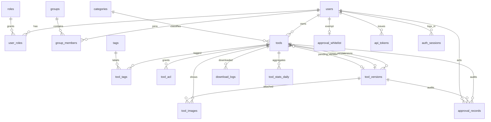

# 数据模型设计

**项目**：localcraft — 内网工具 / Skill 共享平台
**数据库**：SQLite（WAL，默认）/ PostgreSQL（可切换）
**ORM**：SQLAlchemy 2.0（声明式，`Mapped[]` 类型注解风格）
**迁移**：Alembic

---

## 1. 设计原则

### 1.1 跨数据库兼容约束

因为需要「默认 SQLite、可切 PostgreSQL」，所有设计必须遵守：

| 约束 | 做法 | 不做什么 |
| --- | --- | --- |
| 字段类型 | 只用 SQLAlchemy 通用类型：`Integer`、`BigInteger`、`String`、`Text`、`Boolean`、`DateTime`、`Date`、`JSON`、`LargeBinary`、`Numeric` | 不用 `JSONB`、`ARRAY`、`UUID` 原生类型、`ENUM` 原生类型、`TSVECTOR` |
| 枚举 | 用 `String(n)` + 应用层校验 + `CHECK` 约束 | 不用数据库原生 ENUM（SQLite 无、PG 有、迁移麻烦） |
| 主键 | 单列自增 `Integer` 主键 | 不用 UUID 主键（SQLite 上索引膨胀，且不利于范围查询） |
| 时间 | `DateTime(timezone=True)`，**全部以 UTC 存储**，序列化为 ISO8601 带 `Z` | 不存本地时间，不在数据库里做时区转换 |
| 字符串长度 | 在模型里声明 `String(n)`，**由应用层（Pydantic）强制** | 不依赖 SQLite 的 VARCHAR 长度（SQLite 完全忽略） |
| 全文检索 | 抽象成 `SearchBackend` 接口；SQLite 用 FTS5 虚表，PG 用 `pg_trgm`/`tsvector` | 不在业务代码里直接写 FTS5 语法 |
| 大小写敏感 | 所有用户名、标签名、slug 存**归一化后的小写**，另存展示名 | 不依赖 `COLLATE NOCASE`（SQLite 只对 ASCII 生效） |
| 外键 | **必须显式开启** SQLite 的 `PRAGMA foreign_keys=ON`（每个连接都要设） | 不假设外键默认生效 —— SQLite 默认是关闭的 |

> **踩坑提醒**：SQLite 默认不开外键约束，这是最常见的「本地测试通过、切 PG 后炸」的原因。SQLAlchemy 的 `connect` 事件里必须 `PRAGMA foreign_keys=ON`，同时 `PRAGMA journal_mode=WAL`、`PRAGMA busy_timeout=5000`、`PRAGMA synchronous=NORMAL`。

### 1.2 命名约定

- 表名：小写复数下划线（`tool_versions`）
- 字段名：小写单数下划线（`created_at`）
- 外键：`{单数表名}_id`（`tool_id`、`owner_id`）
- 索引：`ix_{表名}_{字段}`，唯一索引 `uq_{表名}_{字段}`，检查约束 `ck_{表名}_{语义}`
- 时间戳统一命名：`created_at`、`updated_at`、`deleted_at`、`published_at`
- 操作人字段：`created_by_id`、`updated_by_id`、`approved_by_id`

### 1.3 公共字段

大部分业务表都带以下字段，后文不再重复解释：

| 字段 | 类型 | 说明 |
| --- | --- | --- |
| `id` | Integer PK | 自增主键 |
| `created_at` | DateTime(tz) NOT NULL | 创建时间，UTC，应用层填充（不用数据库 default，避免 SQLite/PG 默认值差异） |
| `updated_at` | DateTime(tz) NOT NULL | 最后更新时间，UTC，应用层在 `flush` 时更新 |

**软删除**只在 `tools` 表使用（`deleted_at`）。其他表使用物理删除或状态字段，因为软删除会给每个查询都加过滤条件，容易漏。

### 1.4 主键类型选择的取舍

用自增 `Integer` 而非 UUID 的理由：SQLite 的 `INTEGER PRIMARY KEY` 就是 rowid，插入和查找是 O(log n) 且无额外索引开销；UUID 主键在 SQLite 上是随机分布的 B-Tree 键，会导致页分裂与写放大，对百人规模的写入性能影响明显。

代价是 ID 可枚举。因此凡是需要「不可猜测」的场景（下载链接、图片访问），不使用裸 ID 暴露，而是：
- 工具对外 URL 用 `slug`（`/tools/my-tool-a3f2`）
- 图片访问走 `/api/v1/images/{id}` 接口，**接口内做可见性校验**，而非直接静态文件路径

---

## 2. ER 总览



文本版关系（便于快速查阅）：

```
users ──┬── user_roles ──── roles
        ├── group_members ── groups
        ├── tools (owner)
        ├── approval_records (actor)
        ├── approval_whitelist
        ├── api_tokens (creator)
        └── auth_sessions

categories ── tools ──┬── tool_versions ──┬── tool_images
                      │                   └── approval_records
                      ├── tool_tags ── tags
                      ├── tool_acl
                      ├── tool_images
                      ├── download_logs
                      └── tool_stats_daily
```

**循环外键说明**：`tools.current_version_id` 与 `tool_versions.tool_id` 互为引用（循环）。这在 SQLite 与 PG 上都允许，但**创建顺序必须是先建 `tools` 再建 `tool_versions`，且 `tools.current_version_id` 作为可空外键在 `ALTER TABLE` 中后加**（Alembic 迁移里用 `op.create_foreign_key` 单独添加，或使用 `use_alter=True`）。

---

## 3. 表定义

### 3.1 `users` — 用户

| 字段 | 类型 | 约束 | 说明 |
| --- | --- | --- | --- |
| `id` | Integer | PK | |
| `username` | String(64) | NOT NULL, UNIQUE | 登录名。存归一化小写，**创建后不可修改** |
| `display_name` | String(128) | NOT NULL | 展示名，可含中文 |
| `email` | String(255) | NULL | 选填 |
| `password_hash` | String(255) | NOT NULL | Argon2id 哈希（含算法与参数，长度约 97 字符） |
| `password_changed_at` | DateTime(tz) | NULL | 上次改密时间，用于密码有效期策略扩展 |
| `must_change_password` | Boolean | NOT NULL, default `true` | 新建/重置后为 true |
| `status` | String(16) | NOT NULL, default `'active'` | `active` / `disabled` |
| `auth_source` | String(32) | NOT NULL, default `'local'` | `local` / `oidc`。为可插拔认证预留 |
| `external_id` | String(255) | NULL | 外部身份系统的唯一标识（OIDC 的 sub），`UNIQUE` where not null |
| `failed_login_count` | Integer | NOT NULL, default `0` | 连续失败次数 |
| `locked_until` | DateTime(tz) | NULL | 锁定截止时间 |
| `last_login_at` | DateTime(tz) | NULL | |
| `last_login_ip` | String(45) | NULL | 兼容 IPv6 |
| `created_by_id` | Integer | FK → `users.id`, NULL | 自引用；超管自建时为 NULL |
| `created_at` | DateTime(tz) | NOT NULL | |
| `updated_at` | DateTime(tz) | NOT NULL | |

**索引**：`uq_users_username`（唯一）、`ix_users_status`、`ix_users_external_id`（部分唯一索引，仅 PG；SQLite 用普通唯一索引 + 允许 NULL —— SQLite 的唯一索引允许多个 NULL，行为一致，可用普通唯一索引）

**约束**：`ck_users_status` CHECK (`status IN ('active','disabled')`)

**注意**：`display_name` 与 `email` 不设唯一约束。内网可能存在同名同姓，用 `username` 做唯一标识。`username` 一旦创建不可改，因为它是审批记录、日志中的可读标识。

---

### 3.2 `roles` — 角色

| 字段 | 类型 | 约束 | 说明 |
| --- | --- | --- | --- |
| `id` | Integer | PK | |
| `code` | String(32) | NOT NULL, UNIQUE | `superadmin` / `approver` / `user` / `viewer` |
| `name` | String(64) | NOT NULL | 中文名 |
| `description` | String(255) | NULL | |
| `is_builtin` | Boolean | NOT NULL, default `true` | 内置角色不可删除 |
| `permissions` | JSON | NOT NULL, default `[]` | 权限点列表。内置角色由代码定义，此字段仅用于将来扩展自定义角色 |
| `created_at` | DateTime(tz) | NOT NULL | |
| `updated_at` | DateTime(tz) | NOT NULL | |

**说明**：四角色在 Alembic 迁移中以数据迁移形式插入（`op.bulk_insert`），保证任何环境初始状态一致。因为角色集合固定，权限判定在代码中以 `frozenset` 常量定义，`permissions` 字段目前只是冗余备份，**不作为权限判定的来源**（避免数据库被改后提权）。这个决策要写进代码注释。

---

### 3.3 `user_roles` — 用户角色关联

| 字段 | 类型 | 约束 |
| --- | --- | --- |
| `user_id` | Integer | PK, FK → `users.id` ON DELETE CASCADE |
| `role_id` | Integer | PK, FK → `roles.id` ON DELETE CASCADE |
| `granted_by_id` | Integer | FK → `users.id`, NULL |
| `granted_at` | DateTime(tz) | NOT NULL |

**主键**：复合 `(user_id, role_id)`

---

### 3.4 `groups` — 用户组

| 字段 | 类型 | 约束 | 说明 |
| --- | --- | --- | --- |
| `id` | Integer | PK | |
| `name` | String(128) | NOT NULL, UNIQUE | 组名 |
| `description` | String(500) | NULL | |
| `is_active` | Boolean | NOT NULL, default `true` | |
| `created_by_id` | Integer | FK → `users.id`, NULL | |
| `created_at` | DateTime(tz) | NOT NULL | |
| `updated_at` | DateTime(tz) | NOT NULL | |

**说明**：用户组仅用于可见性授权，不承载角色权限（见 FR-GRP-03）。

---

### 3.5 `group_members` — 组成员

| 字段 | 类型 | 约束 |
| --- | --- | --- |
| `group_id` | Integer | PK, FK → `groups.id` ON DELETE CASCADE |
| `user_id` | Integer | PK, FK → `users.id` ON DELETE CASCADE |
| `added_by_id` | Integer | FK → `users.id`, NULL |
| `added_at` | DateTime(tz) | NOT NULL |

**主键**：复合 `(group_id, user_id)`
**索引**：`ix_group_members_user_id`（反查「我属于哪些组」是可见性判定的热点路径，必须有）

---

### 3.6 `categories` — 分类

| 字段 | 类型 | 约束 | 说明 |
| --- | --- | --- | --- |
| `id` | Integer | PK | |
| `slug` | String(64) | NOT NULL, UNIQUE | URL 友好标识，如 `dev-tools` |
| `name` | String(64) | NOT NULL, UNIQUE | 中文名，如「研发工具」 |
| `description` | String(500) | NULL | |
| `icon` | String(64) | NULL | 图标标识（对应前端 lucide 图标名） |
| `sort_order` | Integer | NOT NULL, default `0` | 升序排列 |
| `is_active` | Boolean | NOT NULL, default `true` | 软删除标记 |
| `created_at` | DateTime(tz) | NOT NULL | |
| `updated_at` | DateTime(tz) | NOT NULL | |

**索引**：`ix_categories_sort_order`、`ix_categories_is_active`

---

### 3.7 `tags` — 标签

| 字段 | 类型 | 约束 | 说明 |
| --- | --- | --- | --- |
| `id` | Integer | PK | |
| `name` | String(64) | NOT NULL, UNIQUE | **归一化后**的名称（去空格、小写、全角转半角） |
| `display_name` | String(64) | NOT NULL | 首次创建时的原始写法，用于展示 |
| `usage_count` | Integer | NOT NULL, default `0` | 引用计数，冗余字段，用于「零引用清理」与标签云排序 |
| `created_by_id` | Integer | FK → `users.id`, NULL | |
| `created_at` | DateTime(tz) | NOT NULL | |
| `updated_at` | DateTime(tz) | NOT NULL | |

**说明**：`usage_count` 是冗余字段。维护方式有两种选择，推荐**定时重算**（每小时 `UPDATE tags SET usage_count = (SELECT COUNT(*) FROM tool_tags WHERE tag_id = tags.id)`），而不是在增删关联时维护，因为后者在并发下容易漂移，且这不是强一致需求。

---

### 3.8 `tools` — 工具（核心表）

| 字段 | 类型 | 约束 | 说明 |
| --- | --- | --- | --- |
| `id` | Integer | PK | |
| `slug` | String(128) | NOT NULL, UNIQUE | URL 标识，全局唯一 |
| `name` | String(128) | NOT NULL | 工具名 |
| `summary` | String(500) | NOT NULL | 简介，门户卡片展示 |
| `description_md` | Text | NOT NULL, default `''` | 详情 Markdown 原文 |
| `tool_type` | String(16) | NOT NULL | `file` / `webapp` / `skill` / `prompt` |
| `visibility` | String(16) | NOT NULL, default `'public'` | `public` / `restricted` / `private` |
| `status` | String(24) | NOT NULL, default `'draft'` | `draft`/`pending`/`approved`/`rejected`/`pending_update`/`offline` |
| `owner_id` | Integer | NOT NULL, FK → `users.id`, ON DELETE RESTRICT | 负责人 |
| `category_id` | Integer | NULL, FK → `categories.id`, ON DELETE RESTRICT | |
| `current_version_id` | Integer | NULL, FK → `tool_versions.id`, ON DELETE SET NULL | 唯一对外服务的版本 |
| `pending_version_id` | Integer | NULL, FK → `tool_versions.id`, ON DELETE SET NULL | 待审版本（`pending_update` 状态时有值） |
| `cover_image_id` | Integer | NULL, FK → `tool_images.id`, ON DELETE SET NULL | 封面图 |
| `webapp_url` | String(1024) | NULL | `webapp` 类型必填 |
| `webapp_health_url` | String(1024) | NULL | 二期探活用，本期不写入 |
| `webapp_health_status` | String(16) | NULL | `unknown`/`up`/`down` |
| `webapp_checked_at` | DateTime(tz) | NULL | |
| `download_count` | BigInteger | NOT NULL, default `0` | 冗余计数，内存聚合后批量落库 |
| `view_count` | BigInteger | NOT NULL, default `0` | 同上 |
| `published_at` | DateTime(tz) | NULL | 首次审批通过时间，门户「最新」排序依据 |
| `last_version_at` | DateTime(tz) | NULL | 最近一次版本审批通过时间 |
| `reject_reason` | Text | NULL | 最近一次驳回理由的**冗余副本**，用于列表页快速展示 |
| `offline_reason` | Text | NULL | 最近一次下架理由 |
| `version_seq` | Integer | NOT NULL, default `0` | 乐观锁版本号，每次状态变更 +1 |
| `deleted_at` | DateTime(tz) | NULL | 软删除标记 |
| `deleted_by_id` | Integer | NULL, FK → `users.id` | |
| `created_at` | DateTime(tz) | NOT NULL | |
| `updated_at` | DateTime(tz) | NOT NULL | |

**索引**：

| 索引名 | 字段 | 用途 |
| --- | --- | --- |
| `uq_tools_slug` | `slug` UNIQUE | URL 查找 |
| `ix_tools_status_visibility` | `(status, visibility)` | 门户列表主查询 |
| `ix_tools_owner_status` | `(owner_id, status)` | 我的工具 |
| `ix_tools_category_status` | `(category_id, status)` | 按分类筛选 |
| `ix_tools_published_at` | `published_at DESC` | 「最新」排序 |
| `ix_tools_download_count` | `download_count DESC` | 「热门」排序 |
| `ix_tools_deleted_at` | `deleted_at` | 回收站 |

**约束**：
- `ck_tools_type` CHECK (`tool_type IN ('file','webapp','skill','prompt')`)
- `ck_tools_visibility` CHECK (`visibility IN ('public','restricted','private')`)
- `ck_tools_status` CHECK (`status IN ('draft','pending','approved','rejected','pending_update','offline')`)
- `ck_tools_webapp_url` CHECK (`tool_type <> 'webapp' OR webapp_url IS NOT NULL`)

**冗余字段的取舍说明**：`reject_reason` / `offline_reason` 在 `approval_records` 里已有完整记录，这里冗余一份是为了**避免列表页 N+1 查询**（「我的工具」列表要显示每条的状态说明）。代价是需要保证两处一致 —— 做法是**只在状态变更的同一个事务里，由同一个服务方法同时写两处**，不允许其他地方单独更新这两个字段。

---

### 3.9 `tool_tags` — 工具标签关联

| 字段 | 类型 | 约束 |
| --- | --- | --- |
| `tool_id` | Integer | PK, FK → `tools.id` ON DELETE CASCADE |
| `tag_id` | Integer | PK, FK → `tags.id` ON DELETE CASCADE |

**主键**：复合 `(tool_id, tag_id)`
**索引**：`ix_tool_tags_tag_id`（按标签反查工具）

---

### 3.10 `tool_acl` — 可见性授权

| 字段 | 类型 | 约束 | 说明 |
| --- | --- | --- | --- |
| `id` | Integer | PK | |
| `tool_id` | Integer | NOT NULL, FK → `tools.id` ON DELETE CASCADE | |
| `subject_type` | String(16) | NOT NULL | `user` / `group` |
| `subject_id` | Integer | NOT NULL | 指向 `users.id` 或 `groups.id`，**多态外键，不做数据库级 FK** |
| `can_download` | Boolean | NOT NULL, default `true` | 预留：可区分「可见但不可下载」 |
| `created_by_id` | Integer | NULL, FK → `users.id` | |
| `created_at` | DateTime(tz) | NOT NULL | |

**索引**：
- `uq_tool_acl_subject` UNIQUE `(tool_id, subject_type, subject_id)`
- `ix_tool_acl_subject` `(subject_type, subject_id)` —— **可见性判定的关键索引**

**多态外键的取舍**：`subject_id` 无法建数据库级外键，意味着删除用户或组后会产生悬空 ACL。处理方式：
1. 删除用户组（FR-GRP-04）时由应用层在同一事务内清理 `tool_acl` 中 `subject_type='group'` 的记录
2. 用户不物理删除（FR-IAM-06），所以 `subject_type='user'` 不会悬空
3. 增加一个**每小时运行的一致性检查任务**，清理悬空 ACL 并记录告警日志

替代方案是为 user 和 group 建两张独立的 ACL 表，能拿到外键约束，但会让可见性判定的 SQL 变成两个 `EXISTS` 的 `UNION`，查询复杂度和维护成本都上升。综合取舍选择单表多态 + 应用层保证。

---

### 3.11 `tool_versions` — 工具版本（核心表）

| 字段 | 类型 | 约束 | 说明 |
| --- | --- | --- | --- |
| `id` | Integer | PK | |
| `tool_id` | Integer | NOT NULL, FK → `tools.id` ON DELETE CASCADE | |
| `version` | String(64) | NOT NULL | SemVer 字符串，手填。同工具内唯一 |
| `changelog_md` | Text | NOT NULL, default `''` | 变更说明 Markdown |
| `status` | String(16) | NOT NULL, default `'pending'` | `pending`/`approved`/`rejected`/`superseded`/`purged` |
| `is_current` | Boolean | NOT NULL, default `false` | 冗余标记，加速「查当前版本」。与 `tools.current_version_id` 必须一致 |
| `storage_path` | String(512) | NULL | 相对 `DATA_DIR` 的路径，如 `files/tools/12/345/pkg.zip` |
| `file_name` | String(255) | NULL | 原始文件名，用于下载时 Content-Disposition |
| `file_size` | BigInteger | NULL | 字节 |
| `file_sha256` | String(64) | NULL | 十六进制小写 |
| `file_ext` | String(16) | NULL | 归一化扩展名，如 `zip`、`tar.gz` |
| `mime_type` | String(128) | NULL | |
| `prompt_content` | Text | NULL | `prompt` 类型的正文 |
| `skill_readme_md` | Text | NULL | 提取出的 SKILL.md 正文（截断至 256 KB） |
| `skill_manifest` | JSON | NULL | SKILL.md 的 YAML frontmatter 解析结果 |
| `skill_file_tree` | JSON | NULL | 包内条目数组：`[{path, size, is_dir, sha256}]` |
| `skill_parse_error` | Text | NULL | 解析失败原因（允许带警告存为草稿） |
| `uploaded_by_id` | Integer | NOT NULL, FK → `users.id` | |
| `approved_at` | DateTime(tz) | NULL | |
| `approved_by_id` | Integer | NULL, FK → `users.id` | NULL 表示系统自动批准 |
| `auto_approved_rule` | String(32) | NULL | `auto_approve_all` / `whitelist`，记录自动放行原因 |
| `reject_reason` | Text | NULL | |
| `purged_at` | DateTime(tz) | NULL | 文件被淘汰删除的时间 |
| `created_at` | DateTime(tz) | NOT NULL | |
| `updated_at` | DateTime(tz) | NOT NULL | |

**索引**：
- `uq_tool_versions_tool_version` UNIQUE `(tool_id, version)`
- `ix_tool_versions_tool_created` `(tool_id, created_at DESC)` —— 版本列表与淘汰扫描
- `ix_tool_versions_status` `(status)`
- `ix_tool_versions_sha256` `(file_sha256)` —— 去重检测（同一文件重复上传）

**约束**：
- `ck_tool_versions_status` CHECK (`status IN ('pending','approved','rejected','superseded','purged')`)

**`is_current` 与 `tools.current_version_id` 的双写**：两者是同一事实的两份表示。保留两份的原因：
- `tools.current_version_id` 用于详情页 JOIN 取当前版本
- `is_current` 用于「查询某工具的所有版本并标出当前版本」，避免再 JOIN 回 `tools`

一致性由**唯一部分索引**强制：PG 上可建 `CREATE UNIQUE INDEX ... ON tool_versions(tool_id) WHERE is_current`。SQLite 从 3.8.0 起也支持部分索引，语法相同，因此**两边都能建**。这是防止「一个工具有两个当前版本」的硬保证，比应用层自觉可靠。Alembic 里用 `op.execute()` 手写这段 DDL。

**`purged` 状态的意义**：历史版本超过 10 份时，最旧的版本文件被物理删除（FR-VER-08）。数据库行**保留**并标记 `purged`，原因是 `approval_records` 和 `download_logs` 引用了它，删行会造成审计链断裂。标记为 `purged` 后：
- 不出现在可下载的版本列表中
- 仍出现在审批历史里
- 详情页显示「该版本已归档，不可下载」

---

### 3.12 `tool_images` — 工具图片

| 字段 | 类型 | 约束 | 说明 |
| --- | --- | --- | --- |
| `id` | Integer | PK | |
| `tool_id` | Integer | NOT NULL, FK → `tools.id` ON DELETE CASCADE | |
| `version_id` | Integer | NULL, FK → `tool_versions.id` ON DELETE SET NULL | 截图可归属到具体版本；未指定则属于工具整体 |
| `kind` | String(16) | NOT NULL | `cover` / `screenshot` / `inline` |
| `storage_path` | String(512) | NOT NULL | 原图相对路径 |
| `thumb_path` | String(512) | NULL | 缩略图相对路径（宽 480px） |
| `file_name` | String(255) | NOT NULL | 原始文件名 |
| `mime_type` | String(64) | NOT NULL | |
| `file_size` | Integer | NOT NULL | |
| `width` | Integer | NULL | |
| `height` | Integer | NULL | |
| `sha256` | String(64) | NOT NULL | 用于去重 |
| `sort_order` | Integer | NOT NULL, default `0` | 截图排序 |
| `alt_text` | String(255) | NULL | 无障碍替代文本 |
| `uploaded_by_id` | Integer | NOT NULL, FK → `users.id` | |
| `created_at` | DateTime(tz) | NOT NULL | |

**索引**：`ix_tool_images_tool_kind` `(tool_id, kind, sort_order)`

**约束**：`ck_tool_images_kind` CHECK (`kind IN ('cover','screenshot','inline')`)
**业务约束**（应用层）：每个工具最多 1 张 `cover`，最多 8 张 `screenshot`

---

### 3.13 `approval_records` — 审批记录（不可变流水）

| 字段 | 类型 | 约束 | 说明 |
| --- | --- | --- | --- |
| `id` | Integer | PK | |
| `tool_id` | Integer | NOT NULL, FK → `tools.id` ON DELETE CASCADE | |
| `version_id` | Integer | NULL, FK → `tool_versions.id` ON DELETE SET NULL | 版本相关的动作才有值 |
| `action` | String(24) | NOT NULL | 见下表 |
| `from_status` | String(24) | NULL | 工具状态迁移前 |
| `to_status` | String(24) | NOT NULL | 工具状态迁移后 |
| `version_from_status` | String(16) | NULL | 版本状态迁移前 |
| `version_to_status` | String(16) | NULL | |
| `actor_id` | Integer | NULL, FK → `users.id` | NULL 表示系统自动 |
| `actor_label` | String(128) | NOT NULL | 操作人展示名**快照**（用户改名后历史仍准确） |
| `is_automatic` | Boolean | NOT NULL, default `false` | |
| `auto_rule` | String(32) | NULL | 命中的自动规则 |
| `reason` | Text | NULL | 驳回/下架必填 |
| `note` | Text | NULL | 批准时的可选备注 |
| `request_id` | String(36) | NULL | 关联到应用日志 |
| `created_at` | DateTime(tz) | NOT NULL | |

**动作枚举**：

| `action` | 含义 | 触发者 | `reason` 要求 |
| --- | --- | --- | --- |
| `submit` | 首次提交审批 | owner | 选填 |
| `withdraw` | 撤回提交 | owner | 选填 |
| `resubmit` | 驳回后重新提交 | owner | 选填 |
| `approve` | 批准（含批准新版本） | approver / 系统 | 选填（`note`） |
| `reject` | 驳回 | approver | **必填** |
| `offline` | 下架 | approver | **必填** |
| `relist` | 重新上架 | approver | 选填 |
| `purge_version` | 历史版本被淘汰归档 | 系统 | 系统生成 |
| `transfer_owner` | 转移负责人 | superadmin | 选填 |

**索引**：
- `ix_approval_records_tool_created` `(tool_id, created_at DESC)`
- `ix_approval_records_actor` `(actor_id, created_at DESC)`
- `ix_approval_records_action_created` `(action, created_at DESC)`

**不可变约束**：这张表**只插入，不更新，不删除**。应用层不暴露任何修改接口。`actor_label` 冗余展示名是刻意的 —— 用户改了显示名之后，历史记录必须还原当时的称呼。

---

### 3.14 `approval_whitelist` — 免审白名单

| 字段 | 类型 | 约束 | 说明 |
| --- | --- | --- | --- |
| `user_id` | Integer | PK, FK → `users.id` ON DELETE CASCADE | 一个用户最多一条 |
| `reason` | String(255) | NULL | 加入原因，如「核心工具组」 |
| `added_by_id` | Integer | NULL, FK → `users.id` | |
| `expires_at` | DateTime(tz) | NULL | 可设临时免审；NULL 表示永久 |
| `created_at` | DateTime(tz) | NOT NULL | |

**说明**：用 `user_id` 作主键而非独立 id，因为业务上「一个用户最多一条免审记录」，主键即约束。

---

### 3.15 `api_tokens` — 管理 API 令牌

| 字段 | 类型 | 约束 | 说明 |
| --- | --- | --- | --- |
| `id` | Integer | PK | |
| `name` | String(128) | NOT NULL | 用途描述，如「CI 发布脚本」 |
| `token_prefix` | String(16) | NOT NULL | 前 8 位明文，用于列表页识别，如 `st_a1b2c3d4` |
| `token_hash` | String(64) | NOT NULL, UNIQUE | 完整 Token 的 SHA256 十六进制 |
| `scopes` | JSON | NOT NULL | 字符串数组，如 `["tools:read","tools:write"]` |
| `created_by_id` | Integer | NOT NULL, FK → `users.id` | |
| `expires_at` | DateTime(tz) | NULL | NULL 表示永不过期 |
| `last_used_at` | DateTime(tz) | NULL | 每次使用更新 |
| `last_used_ip` | String(45) | NULL | |
| `revoked_at` | DateTime(tz) | NULL | |
| `revoked_by_id` | Integer | NULL, FK → `users.id` | |
| `created_at` | DateTime(tz) | NOT NULL | |

**索引**：`ix_api_tokens_hash`（唯一索引已覆盖）、`ix_api_tokens_created_by`

**关键安全设计**：
1. 明文 Token 只在签发响应中返回一次，之后无法再取回
2. 存 SHA256 而非 bcrypt/argon2 的原因：Token 是 256 bit 高熵随机串，不存在被暴力破解的可能，因此不需要慢哈希；而鉴权是**每个请求**都要做的事，用慢哈希会直接把 API 吞吐打死。这是「高熵凭证用快哈希、低熵密码用慢哈希」的标准做法
3. 鉴权时先按 `token_hash` 查（唯一索引命中），再校验未吊销、未过期、Scope 匹配
4. `last_used_at` 的更新会带来**每个请求一次写操作** —— 在 SQLite 单写者模型下这是明确的性能风险。处理方式：`last_used_at` 走**内存聚合，每 60 秒批量更新一次**，不逐请求落库。这与下载计数的处理策略一致

---

### 3.16 `auth_sessions` — 登录会话

| 字段 | 类型 | 约束 | 说明 |
| --- | --- | --- | --- |
| `id` | Integer | PK | |
| `user_id` | Integer | NOT NULL, FK → `users.id` ON DELETE CASCADE | |
| `refresh_token_hash` | String(64) | NOT NULL, UNIQUE | SHA256 |
| `user_agent` | String(255) | NULL | |
| `ip` | String(45) | NULL | |
| `expires_at` | DateTime(tz) | NOT NULL | |
| `revoked_at` | DateTime(tz) | NULL | |
| `last_used_at` | DateTime(tz) | NULL | |
| `created_at` | DateTime(tz) | NOT NULL | |

**索引**：`ix_auth_sessions_user` `(user_id)`、`ix_auth_sessions_expires` `(expires_at)`

**说明**：refresh token 需要服务端可吊销（FR-AUTH-07、FR-IAM-05），所以必须落库。access token 是无状态 JWT，不落库。清理任务定期删除过期超 30 天的会话行。

---

### 3.17 `download_logs` — 下载明细

| 字段 | 类型 | 约束 | 说明 |
| --- | --- | --- | --- |
| `id` | Integer | PK | |
| `tool_id` | Integer | NOT NULL, FK → `tools.id` ON DELETE CASCADE | |
| `version_id` | Integer | NULL, FK → `tool_versions.id` ON DELETE SET NULL | |
| `user_id` | Integer | NULL, FK → `users.id` ON DELETE SET NULL | |
| `ip` | String(45) | NULL | |
| `user_agent` | String(255) | NULL | 截断存储 |
| `via_api_token_id` | Integer | NULL, FK → `api_tokens.id` ON DELETE SET NULL | 区分人工下载与脚本下载 |
| `created_at` | DateTime(tz) | NOT NULL | |

**索引**：`ix_download_logs_tool_created` `(tool_id, created_at DESC)`、`ix_download_logs_user_created` `(user_id, created_at DESC)`、`ix_download_logs_created` `(created_at)`

**写入策略**：**批量插入**，不逐条提交。应用侧维护一个内存队列，每 100 条或每 10 秒 flush 一次（`bulk_insert_mappings`）。这同样是为了规避 SQLite 写锁。

**保留策略**：超过 180 天（可配）的行由每日清理任务删除，**按批次删除**（每批 1000 行）避免长事务锁库。

---

### 3.18 `tool_stats_daily` — 每日统计汇总

| 字段 | 类型 | 约束 | 说明 |
| --- | --- | --- | --- |
| `id` | Integer | PK | |
| `tool_id` | Integer | NOT NULL, FK → `tools.id` ON DELETE CASCADE | |
| `stat_date` | Date | NOT NULL | UTC 日期 |
| `views` | Integer | NOT NULL, default `0` | |
| `downloads` | Integer | NOT NULL, default `0` | |
| `unique_visitors` | Integer | NOT NULL, default `0` | 二期可用 |

**索引**：`uq_tool_stats_daily` UNIQUE `(tool_id, stat_date)`、`ix_tool_stats_daily_date` `(stat_date)`

**写入方式**：UPSERT。SQLite 用 `INSERT ... ON CONFLICT(tool_id, stat_date) DO UPDATE`，PG 语法相同 —— **两者都支持 `ON CONFLICT`**，这是 SQLite 3.24+ 与 PG 9.5+ 的共有特性，所以这段 SQL 可以跨库复用。由定时任务从内存计数器中聚合写入，每 30 秒一次。

---

### 3.19 `system_settings` — 系统设置

| 字段 | 类型 | 约束 | 说明 |
| --- | --- | --- | --- |
| `key` | String(64) | PK | 点分命名，如 `approval.mode` |
| `value` | JSON | NOT NULL | |
| `value_type` | String(16) | NOT NULL | `bool`/`int`/`string`/`json`/`list`，用于前端渲染与后端校验 |
| `is_public` | Boolean | NOT NULL, default `false` | 是否可通过 `/api/v1/meta` 匿名下发 |
| `description` | String(500) | NULL | |
| `updated_by_id` | Integer | NULL, FK → `users.id` | |
| `updated_at` | DateTime(tz) | NOT NULL | |

**说明**：以 `key` 作主键（不用自增 id），因为设置项天然以 key 寻址，且迁移脚本需要幂等地 `INSERT OR IGNORE` 初始值。

**跨库 UPSERT**：`INSERT INTO system_settings ... ON CONFLICT(key) DO UPDATE SET value=...` 在 SQLite 与 PG 语法一致，可复用。

**设置项清单**（迁移时以默认值插入）：

| key | 类型 | 默认值 | 公开 | 说明 |
| --- | --- | :---: | :---: | --- |
| `approval.mode` | string | `"require"` | 否 | `require` / `auto_approve_all` |
| `approval.whitelist_enabled` | bool | `true` | 否 | 免审白名单总开关 |
| `approval.version_reapproval` | bool | `true` | 否 | 已发布工具发新版本是否需再审 |
| `version.history_limit` | int | `10` | 否 | 历史版本保留份数 |
| `upload.max_file_size_mb` | int | `200` | 否 | |
| `upload.allowed_extensions` | list | 见 SRS 第 8 章 | 否 | |
| `upload.max_screenshots` | int | `8` | 否 | |
| `upload.max_tags` | int | `8` | 否 | |
| `quota.per_user_mb` | int | `2048` | 否 | 0 = 不限 |
| `quota.total_mb` | int | `51200` | 否 | 0 = 不限 |
| `quota.warn_threshold_pct` | int | `85` | 否 | 达到此百分比时告警 |
| `security.access_token_minutes` | int | `30` | 否 | |
| `security.refresh_token_days` | int | `7` | 否 | |
| `security.login_max_failures` | int | `5` | 否 | |
| `security.lockout_minutes` | int | `15` | 否 | |
| `portal.site_name` | string | `"工具与 Skill 平台"` | **是** | |
| `portal.announcement_md` | string | `""` | **是** | 首页公告 |
| `portal.allow_anonymous_view` | bool | `false` | **是** | |
| `portal.allow_admin_view_private` | bool | `true` | 否 | 见待确认 Q1 |
| `portal.default_sort` | string | `"hot"` | **是** | `hot`/`new`/`name` |
| `portal.page_size` | int | `24` | **是** | |
| `stats.download_log_retention_days` | int | `180` | 否 | |
| `stats.view_dedup_minutes` | int | `60` | 否 | 浏览去重窗口 |
| `webapp.health_check_enabled` | bool | `false` | 否 | 二期 |
| `api.docs_enabled` | bool | `false` | 否 | 是否开放 /docs |

---

### 3.20 `tool_search_index` — 全文检索索引（SQLite FTS5）

这是**唯一的 SQLite 专属结构**，必须被 `SearchBackend` 抽象隔离。

```sql
CREATE VIRTUAL TABLE tool_search_index USING fts5(
    name,
    summary,
    description,
    tags,
    content='',              -- 外部内容模式，不重复存储原文
    tokenize='unicode61 remove_diacritics 2'
);
```

**为什么用外部内容模式（`content=''`）**：默认的 FTS5 会把原文完整复制一份，详情正文可能很长，会造成数据库体积翻倍。外部内容模式只存索引，原文仍在 `tools` 表。

**中文分词问题**：FTS5 的 `unicode61` 分词器把中文整体当作一个 token（中文没有空格分隔），导致「工具」搜不到「内网工具平台」。可用方案：

| 方案 | 效果 | 成本 |
| --- | --- | --- |
| `unicode61` + 应用层在写入前把中文按**单字**插入索引（`内 网 工 具`） | 中文可按字匹配，召回率高，精度一般 | 低，推荐 |
| `trigram` 分词器（SQLite 3.34+） | 支持任意子串匹配，中文效果好 | 索引体积大，需确认 openEuler 的 SQLite 版本 |
| 引入 `zhparser` / jieba 分词 | 效果最好 | 需要维护词表，且 PG 侧又有不同实现，复杂度高 |

**推荐做法**：写入索引时把 `name`/`summary`/`description`/`tags` 拼成一个文档字符串，其中中文部分按单字加空格切分、英文数字保持整词。查询时对关键词做同样的处理。这样 SQLite 与将来 PG 的 `zhparser` 行为可以做到近似。

**索引同步**：不依赖数据库触发器（SQLite 与 PG 的触发器语法差异大），而是在应用层的工具写操作里显式调用 `search_backend.upsert(tool_id, document)`。**由同一个事务包裹**，保证索引与数据一致。另外提供 `python -m app.cli reindex-search` 命令用于全量重建。

---

### 3.21 `tool_favorites` — 个人收藏（M8 新增）

```sql
CREATE TABLE tool_favorites (
    id         INTEGER PRIMARY KEY,
    user_id    INTEGER NOT NULL REFERENCES users(id) ON DELETE CASCADE,
    tool_id    INTEGER NOT NULL REFERENCES tools(id) ON DELETE CASCADE,
    created_at DATETIME NOT NULL,
    UNIQUE (user_id, tool_id)
);
CREATE INDEX ix_tool_favorites_user_created ON tool_favorites (user_id, created_at DESC);
CREATE INDEX ix_tool_favorites_tool_id      ON tool_favorites (tool_id);
```

**`UNIQUE(user_id, tool_id)` 同时是业务约束与并发防线**：`PUT`/`DELETE` 端点要求幂等
（契约 §23.4），并发重复 `PUT` 靠这个唯一约束兜底 —— 服务层捕获 `IntegrityError`
后回滚并按成功处理，而不是把它冒成 500。

**`(user_id, created_at DESC)` 用手写 DDL**：Alembic 的 `create_index` 表达不了索引列的
`DESC` 方向，故迁移里直接发 SQL。这条索引支撑「我的收藏」按收藏时间倒序。

### 3.22 `tool_likes` — 个人点赞（M8 新增）

结构与 `tool_favorites` **完全一致**，仅表名不同：

```sql
CREATE TABLE tool_likes (
    id         INTEGER PRIMARY KEY,
    user_id    INTEGER NOT NULL REFERENCES users(id) ON DELETE CASCADE,
    tool_id    INTEGER NOT NULL REFERENCES tools(id) ON DELETE CASCADE,
    created_at DATETIME NOT NULL,
    UNIQUE (user_id, tool_id)
);
CREATE INDEX ix_tool_likes_user_created ON tool_likes (user_id, created_at DESC);
CREATE INDEX ix_tool_likes_tool_id      ON tool_likes (tool_id);
```

**为什么是「点赞」而不是 1~5 评分**：见 `docs/00` **D37**。每人每工具至多一票、
可取消、只展示整数计数。百人规模的小团队里，平均分会产出 `4.7` 这类**假装精确**的
数字，且极易变成人情分；整数点赞数不承诺精度，因此不误导。

**两表在 `tools` 上的反规范化计数**：`tools.favorite_count` / `tools.like_count`
（`Integer NOT NULL DEFAULT 0`）与关系表写入**同事务**维护。

**为什么反规范化**：列表接口若实时聚合，需要 JOIN + GROUP BY，而 `docs/11` §2.2
记录了列表当前是 4 条查询、且 CPU 随并发放大尚未定位。契约 §23.3 因此**禁止**改为
实时聚合。减法一律写成 `CASE WHEN count > 0 THEN count - 1 ELSE 0`，避开
`max()` / `GREATEST` 的方言差异。`tools.estimated_saving_minutes` 的语义见契约 §23.3。

---

## 4. 关键查询与索引验证

以下列出最热的 5 个查询，以及它们依赖的索引。

### Q1 门户列表（带可见性过滤）

```sql
SELECT t.*
FROM tools t
WHERE t.deleted_at IS NULL
  AND t.status IN ('approved', 'pending_update')
  AND t.visibility = 'public'
ORDER BY t.download_count DESC
LIMIT 24 OFFSET 0;
```
→ 走 `ix_tools_status_visibility` + `ix_tools_download_count`。

### Q2 门户列表（含受限工具，登录用户）

```sql
SELECT DISTINCT t.*
FROM tools t
LEFT JOIN tool_acl a
       ON a.tool_id = t.id
      AND (
            (a.subject_type = 'user'  AND a.subject_id = :uid)
         OR (a.subject_type = 'group' AND a.subject_id IN (
                SELECT group_id FROM group_members WHERE user_id = :uid
            ))
          )
WHERE t.deleted_at IS NULL
  AND t.status IN ('approved', 'pending_update')
  AND (t.visibility = 'public'
       OR t.visibility = 'private'      AND t.owner_id = :uid
       OR t.visibility = 'restricted'   AND a.id IS NOT NULL)
ORDER BY t.download_count DESC
LIMIT 24;
```
→ 依赖 `ix_tools_status_visibility`、`ix_tool_acl_subject`、`ix_group_members_user_id`。

**这是全平台最重的查询**。优化建议：
1. 把 `group_members` 的子查询结果在应用层先查出来（一个用户通常只属于个位数个组），直接内联成 `IN (1,5,9)`，避免关联子查询
2. 该查询结果可按 `(user_id, filter_hash)` 做 **30 秒短缓存**（内存缓存即可，百人规模命中率很高）
3. 如果 `EXPLAIN QUERY PLAN` 显示 SQLite 选择了错误的索引，用 `ANALYZE` 更新统计信息，或改用 CTE 拆成两步

### Q3 我的工具

```sql
SELECT t.*, (SELECT COUNT(*) FROM tool_versions v
             WHERE v.tool_id = t.id AND v.status = 'superseded') AS history_count
FROM tools t
WHERE t.owner_id = :uid AND t.deleted_at IS NULL
ORDER BY t.updated_at DESC;
```
→ 走 `ix_tools_owner_status`。

### Q4 待审版本淘汰扫描

```sql
SELECT id, storage_path
FROM tool_versions
WHERE tool_id = :tid
  AND status = 'superseded'
  AND id NOT IN (
      SELECT id FROM tool_versions
      WHERE tool_id = :tid AND status = 'superseded'
      ORDER BY created_at DESC LIMIT :limit
  );
```
→ 走 `ix_tool_versions_tool_created`。

### Q5 Token 鉴权

```sql
SELECT * FROM api_tokens
WHERE token_hash = :hash AND revoked_at IS NULL
  AND (expires_at IS NULL OR expires_at > :now);
```
→ 走 `uq_api_tokens_token_hash`。单索引点查，极快。

---

## 5. 数据保留与清理任务

由 APScheduler（或 asyncio 后台任务）调度，全部为**幂等**操作。

| 任务 | 频率 | 动作 | 影响表 |
| --- | --- | --- | --- |
| 计数落库 | 每 30 秒 | 把内存中的下载/浏览计数与 `last_used_at` 刷入库 | `tools`、`tool_stats_daily`、`api_tokens` |
| 下载明细落库 | 每 10 秒或 100 条 | 批量插入内存队列中的下载记录 | `download_logs` |
| 历史版本淘汰 | 版本审批通过时**同步触发** | 超出上限的 `superseded` 版本转 `purged` 并删文件 | `tool_versions` |
| 下载明细清理 | 每日 03:00 | 删除超过保留期的行（分批 1000） | `download_logs` |
| 会话清理 | 每日 03:10 | 删除过期超 30 天的行 | `auth_sessions` |
| 孤儿文件清理 | 每日 03:20 | 扫描 `files/` 下无数据库引用的文件并删除（先移入 `files/.trash/`，保留 7 天） | 文件系统 |
| 悬空 ACL 清理 | 每小时 | 清理 `subject_type='group'` 但组已不存在的记录 | `tool_acl` |
| 标签计数重算 | 每小时 | 重算 `tags.usage_count` | `tags` |
| 回收站清理 | 每日 03:30 | 软删除超 30 天的工具彻底清除（含文件） | `tools` |
| 备份 | 每日 02:00 | 见部署文档 | 文件系统 |

**关于「历史版本淘汰」为什么是同步触发**：如果做成定时任务，那么用户批准第 11 个版本后、清理任务跑之前，磁盘上会短暂存在 11 份。这是可接受的，但会让「最多保留 10 份」这条需求在验收时难以断言。同步触发（在审批通过的事务**提交之后**、异步执行文件删除）既能保证语义准确，又不会因为文件删除失败而回滚审批。文件删除失败时记警告日志，由孤儿文件清理兜底。

---

## 6. 迁移策略（Alembic）

### 6.1 迁移文件组织

```
migrations/
  versions/
    0001_initial_schema.py        # 全部表结构
    0002_seed_roles_and_settings.py  # 角色、系统设置初始数据
    0003_create_fts_index.py      # SQLite FTS5 虚表（条件执行）
```

**原则**：
- 结构变更与数据播种**分开**成不同迁移文件，便于回滚时区分
- FTS5 虚表的创建必须判断方言：`if op.get_bind().dialect.name == 'sqlite'`。切到 PG 时该迁移跳过，另写 PG 版本的全文索引迁移
- 每个迁移都要写 `downgrade()`，即使只是 `pass` 也要写清楚为何不能回滚

### 6.2 从 SQLite 迁移到 PostgreSQL 的流程

这是本项目最重要的可演进性保证，必须写成文档并演练一次：

**前置条件（M4 checkpoint 补入，2025-03）**：目标机必须安装 PostgreSQL 驱动。
驱动是 **optional extra**，默认的 SQLite 部署不会安装它：

```bash
# 离线环境：从发布包的 wheelhouse 安装（两个架构的 wheelhouse 都已包含）
/opt/localcraft/venv/bin/pip install --no-index \
    --find-links /opt/localcraft/wheelhouse-$(uname -m | sed 's/x86_64/x86_64/;s/aarch64/aarch64/') \
    "psycopg[binary]"

# 有内网私有 PyPI 源时
/opt/localcraft/venv/bin/pip install "psycopg[binary]"
```

> 早先本文档写的「切 PostgreSQL 只改连接串」是不完整的 —— 干净安装的机器上驱动根本没装。
> 现在把这一步显式化：**改连接串 + 装驱动**。

```bash
# 1. 在旧环境导出数据（应用层导出，不导 DDL）
python -m app.cli export-data --output /tmp/localcraft-data.json

# 2. 在新环境准备空的 PG 库，跑全量迁移
DATABASE_URL=postgresql+psycopg://... alembic upgrade head

# 3. 导入数据（应用层写入，自动触发 FTS 重建）
DATABASE_URL=postgresql+psycopg://... python -m app.cli import-data /tmp/localcraft-data.json

# 4. 复制文件目录
rsync -a /var/lib/localcraft/files/ newhost:/var/lib/localcraft/files/

# 5. 校验：工具数、版本数、文件 SHA256 抽样比对
python -m app.cli verify-integrity --sample 100
```

**不采用**「pgloader 直接搬 SQLite」的原因：类型映射（布尔、日期、JSON）会出偏差，且 FTS5 索引无法迁移，最终还是要重建。走应用层导出导入虽然慢，但数据语义有保证，且天然完成了一次「数据可迁移性」的验证。

### 6.3 迁移的部署要求

- 每次升级**必须先备份**（见部署文档）
- Alembic 迁移在服务启动**之前**执行，不允许应用启动时自动迁移（多进程下会有竞争，且失败时服务已经起来了）
- 迁移脚本必须支持在**事务中**执行（SQLite 支持事务性 DDL，PG 也支持），失败则整体回滚

---

## 7. 数据量估算

按 100 用户、每用户平均 5 个工具、每工具平均 3 个版本估算：

| 表 | 预估行数 | 单行估算 | 小计 |
| --- | --- | --- | --- |
| `users` | 100 | 500 B | 50 KB |
| `tools` | 500 | 3 KB（含详情正文） | 1.5 MB |
| `tool_versions` | 1500 | 2 KB（含 changelog） | 3 MB |
| `tool_versions`（Skill 包解析结果，约 10%） | 150 | 100 KB（SKILL.md + 文件树 JSON） | 15 MB |
| `tool_images` | 2500 | 300 B | 750 KB |
| `approval_records` | 5000 | 500 B | 2.5 MB |
| `download_logs` | 100 用户 × 20 次/月 × 12 月 = 24000 | 300 B | 7 MB |
| `tool_stats_daily` | 500 × 365 | 100 B | 18 MB |
| 其余小表 | — | — | < 1 MB |
| **数据库合计** | | | **≈ 50 MB/年** |

**文件存储**（真正的容量大头）：

| 类型 | 估算 |
| --- | --- |
| 工具包（平均 20 MB × 1500 版本） | 30 GB |
| 图片原图 + 缩略图 | 2 GB |
| **合计** | **≈ 32 GB** |
| 备份占用（保留 3 份，其中 1 份全量 + 2 份增量） | ≈ 40 GB |
| **总磁盘需求建议** | **100 GB 起，推荐 200 GB** |

**结论**：50 MB/年的数据库对 SQLite 来说毫无压力（SQLite 在几十 GB 级别都能工作）。瓶颈在文件存储和备份，因此：
- 文件目录建议单独挂盘，便于扩容和独立备份
- 50 GB 的平台总配额默认值是合理的，约占磁盘的一半
- 若工具平均体积远超 20 MB（例如包含大模型权重、数据集），需要重新评估，并考虑引入对象存储

---

## 8. 附录：枚举值总表

| 枚举 | 取值 | 定义位置 |
| --- | --- | --- |
| `users.status` | `active` / `disabled` | SRS FR-IAM-05 |
| `users.auth_source` | `local` / `oidc` | SRS FR-AUTH-08 |
| `roles.code` | `superadmin` / `approver` / `user` / `viewer` | SRS 3.1 |
| `tools.tool_type` | `file` / `webapp` / `skill` / `prompt` | SRS FR-TOOL-02 |
| `tools.visibility` | `public` / `restricted` / `private` | SRS FR-ACL-01 |
| `tools.status` | `draft` / `pending` / `approved` / `rejected` / `pending_update` / `offline` | SRS 4.1 |
| `tool_versions.status` | `pending` / `approved` / `rejected` / `superseded` / `purged` | SRS 4.2 |
| `tool_acl.subject_type` | `user` / `group` | SRS FR-ACL-02 |
| `tool_images.kind` | `cover` / `screenshot` / `inline` | SRS FR-FILE-09 |
| `approval_records.action` | `submit` / `withdraw` / `resubmit` / `approve` / `reject` / `offline` / `relist` / `purge_version` / `transfer_owner` | SRS 5.10 |
| `api_tokens.scopes[]` | `tools:read` / `tools:write` / `approvals:write` / `users:write` / `groups:write` / `taxonomy:write` / `settings:write` / `admin:all` | SRS FR-API-03 |
| `system_settings.approval.mode` | `require` / `auto_approve_all` | SRS FR-APPR-01 |

**实现建议**：所有枚举在 Python 侧用 `enum.StrEnum`（3.11 原生支持）定义一次，数据库里存字符串，Pydantic 模型引用同一个枚举。**不要在三个地方各写一遍字符串字面量** —— 这是这类项目最容易积累的隐性 bug。
